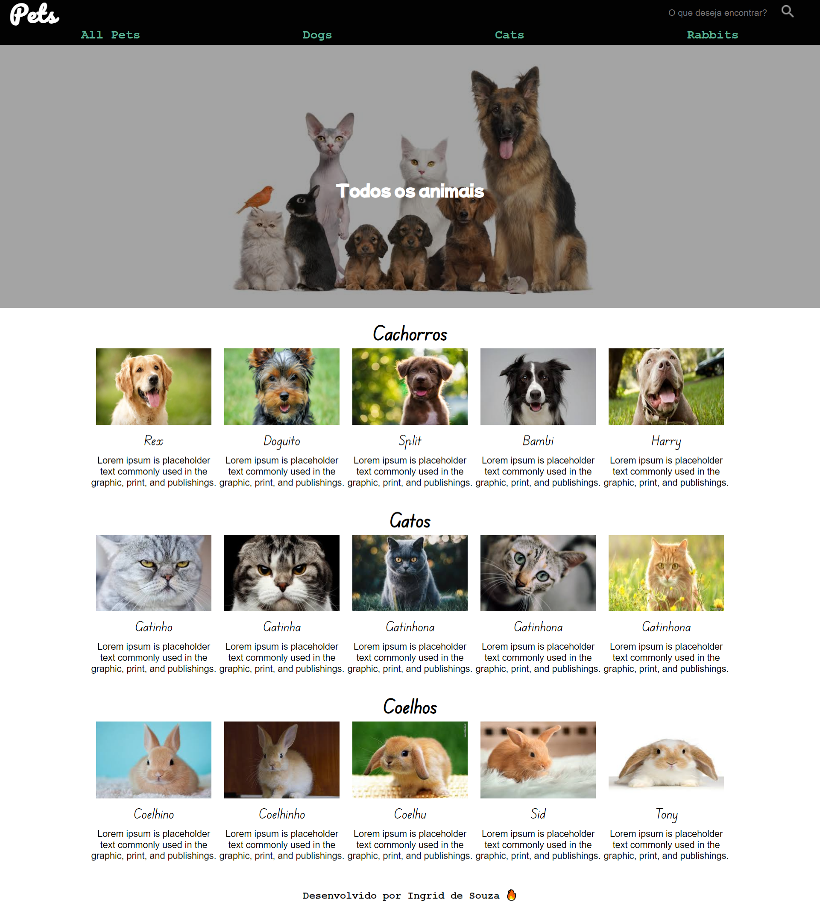

# Pet Info.
Estou desenvolvendo este site de informações sobre alguns pets, para práticar alguns conceitos que aprendi no javascript.

º Quando clicado nos botões de outros animais, o estilo é modificado especificamente para àquele animal.

º A barra de pesquisa filtra os itens pelo nome e mostra na tela, caso seja encontrado o animal.

º Os arquivos foram adicionados a partir de um arquivo db.json, que contém todas as informações sobre cada animal.

º Foi utilizado as linguagens HTML, CSS e Javascript puro.

## Table of contents

- [Screenshot](#screenshot)
- [Links](#links)
- [Author](#author)

### Screenshot

### Links

- Solution URL: [Solution here](https://ingridssilveira.github.io/petInfo/)

## Author

- Website - [Ingrid Souza](https://ingridssilveira.github.io/IngridSouza)
- GitHub - [@IngridsSilveira](https://github.com/IngridsSilveira)
